# COMPLETE GITLAB CICD PROJECT 

## **Context**

The objective of this project is to create a **Continuous Integration (CI)** and **Continuous Deployment (CD)** pipeline for deploying a **Flask web** application on **AWS**. The server must be accessible via SSH. The idea is to implement the necessary steps to ensure code quality and security while automating the deployment process.
---
Here is the GitFlow model to implement:
- On the main branch (**main**), all stages must be executed, except the review deployment.

- On **other branches**, only the following stages must be executed:

    - Linter
    - Build
    - Security Scan (Docker Image)
    - Automated Tests
    - Code Quality Check

- During a **Pull Request (PR)**, in addition to the previous stages, the **packaging** and **review** deployment stages must be executed.

## **Prerequisites**

#### **AWS**
1) Create an account if not yet done.
2) Create a key pair and download the **.pem** file that contains the **AWS_ACCESS_KEY_ID** and **AWS_SECRET_ACCESS_KEY** variables.
3) Create a security group with the following rules shown below:
**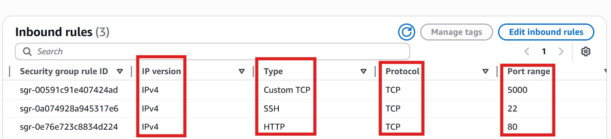**
4) Create two instances (for **staging** and **production**). Do not forget to attach both key pair and security group previously created. Also note the Public DNS that will be used in both **HOSTNAME_DEPLOY_STAGING** and **HOSTNAME_DEPLOY_PROD** variables.

#### **SonarCloud**
1) Create an account if not yet done.
2) In the security section, generate a token that will be required in the gitlab pipeline.

**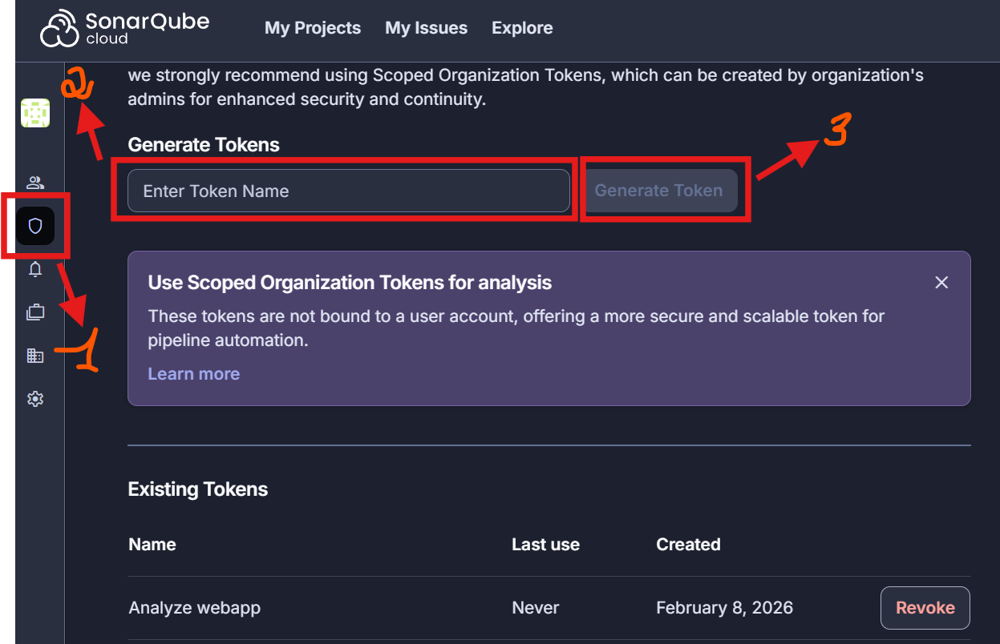**

3) Also retrieve the **SONAR_ORGANIZATION** and **SONAR_PROJECT_KEY** variables.

#### **GitLab**
1) Create a gitlab account if not done yet.
2) Create a git project and import all the files.
3) Go to **Settings --> CICD --> VARIABLES --> Project variables**, then add the following variables: **AWS_ACCESS_KEY_ID**, **AWS_SECRET_ACCESS_KEY**, **AWS_DEFAULT_REGION**, **HOSTNAME_DEPLOY_STAGING**, **HOSTNAME_DEPLOY_PROD**, **SONAR_ORGANIZATION**, **SONAR_PROJECT_KEY**, **SONAR_HOST_URL**, **SSH_USER** and **SSH_KEY**.

**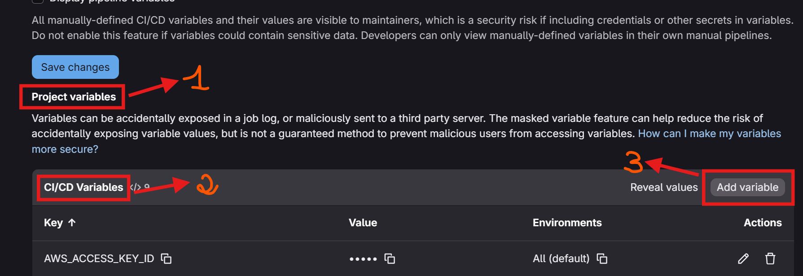**

## **Stage 1: Lint** 

The goal is to validate the syntax of the code with the means of **flake8** and **hadolint**. **This stage will always be trigered after a push on any branch**.

**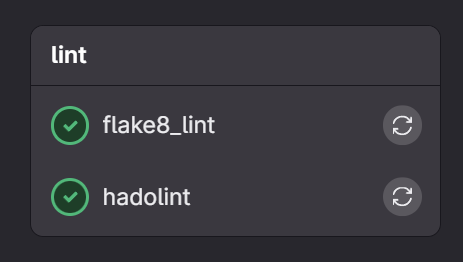**

## **Stage 2: Contenerization of the web app** 

The goal is to build a docker image as an artefact. **This stage will always be trigered after a push on any branch**.

**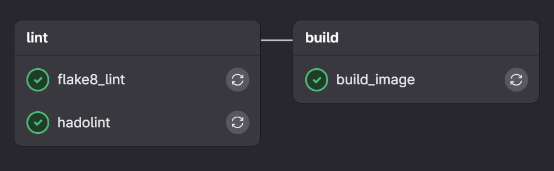**
**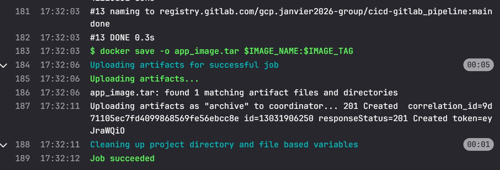**

## **Stage 3: Security Scan** 

**This stage will always be trigered after a push on any branch**.

## **Stage 4: Tests** 

At this stage, all the **unitary** and **integration** tests will be executed simultaneously. **This stage will always be trigered after a push on any branch**.

**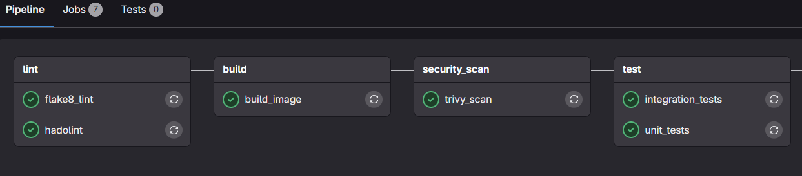**
**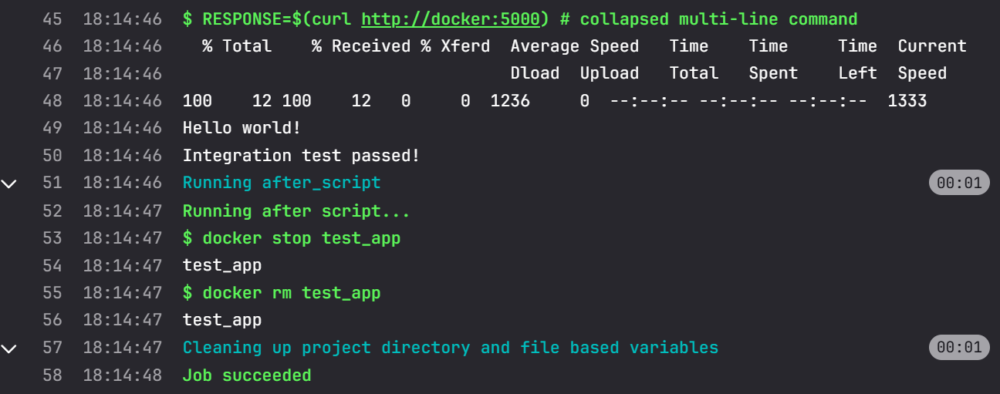**
****

## **Stage 5: Code quality** 

We want to perform a static analysis of the code to ensure that the quality norms are respected. After several trials, I got this result. **This stage will always be trigered after a push on any branch**.

**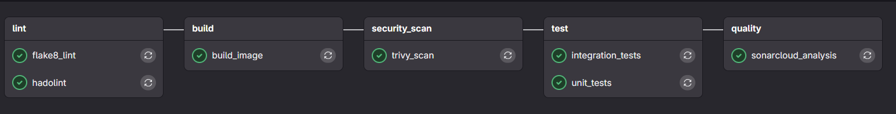**
**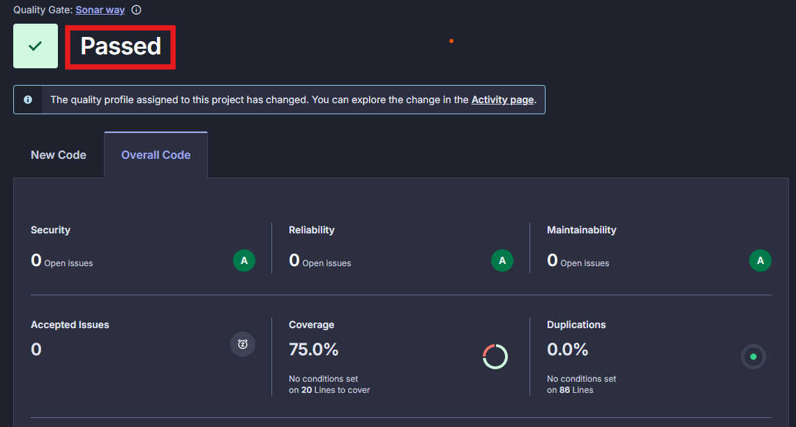**

## **Stage 6: Packaging** 

After all the above verifications, we can now create a release of the app and push it to the gitlab container registry. **This stage will be executed only on main branch and during merge_requests**. 

**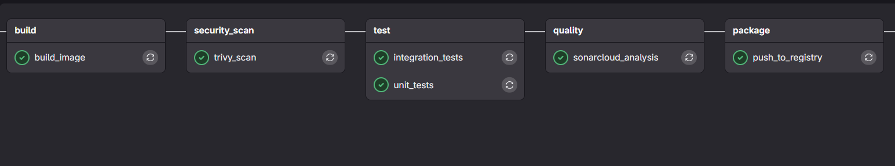**
**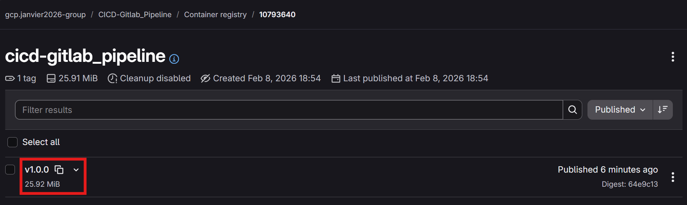**

## **Stage 7: Dynamic Deployment**

In this stage, we will deploy the app in a review environment. Inside this environment, the app will be tested. At the end, it will be deleted manually **This stage will be executed only during merge_requests**.
---
The first thing is to create a new branch from the main branch. Then, comment all stages (with dot in front of the name of the stage) except the deployment in staging and production environments as well as the validation tests. Afterward, a pipeline will be triggered except from package to validation tests.

**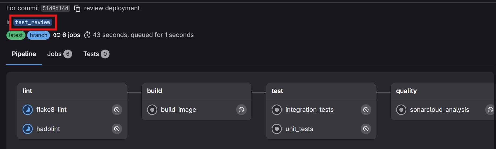**

Then, we can create a merge request to add the deployment in review environment.

****

**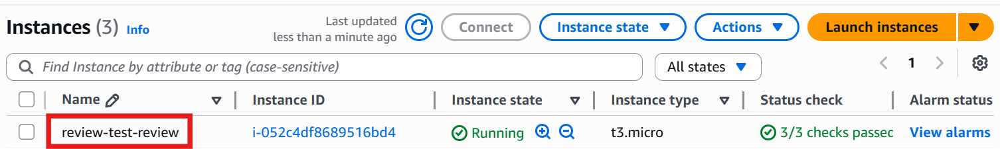**

**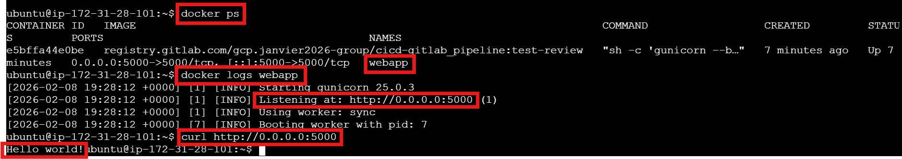**

After successful deployment, we will delete the instance.

**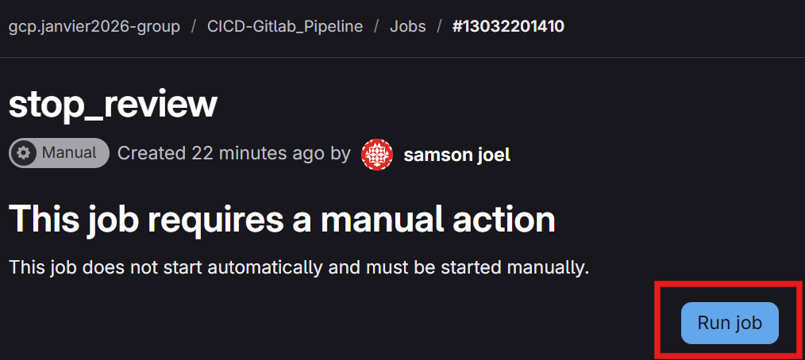**

**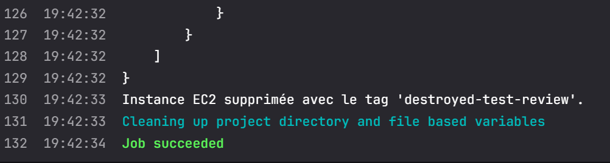**

**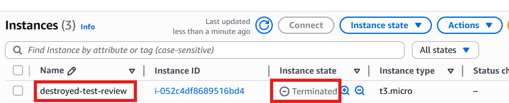**