# 🚀 GitLab CI/CD Pipeline

Automated Continuous Integration and Continuous Deployment pipeline for a Flask web application on AWS.

---

## 📋 Table of Contents

- [Overview](#-overview)
- [Architecture](#-architecture)
- [GitFlow Strategy](#-gitflow-strategy)
- [Prerequisites](#-prerequisites)
  - [AWS Setup](#-aws-setup)
  - [SonarCloud Setup](#-sonarcloud-setup)
  - [GitLab Configuration](#-gitlab-configuration)
- [Pipeline Stages](#-pipeline-stages)
  - [Stage 1: Lint](#stage-1-lint)
  - [Stage 2: Build](#stage-2-build)
  - [Stage 3: Security Scan](#stage-3-security-scan)
  - [Stage 4: Tests](#stage-4-tests)
  - [Stage 5: Code Quality](#stage-5-code-quality)
  - [Stage 6: Packaging](#stage-6-packaging)
  - [Stage 7: Review Deployment](#stage-7-review-deployment)
  - [Stage 8: Staging & Production](#stage-8-staging--production)
  - [Stage 9: Validation Tests](#stage-9-validation-tests)
- [Troubleshooting](#-troubleshooting)

---

## 🎯 Overview

This project implements a complete CI/CD pipeline using GitLab for deploying a Flask web application on AWS infrastructure. The pipeline ensures code quality, security scanning, and automated multi-environment deployments.

### ✨ Features

| Feature | Description |
|---------|-------------|
| 🔍 **Linting** | Code syntax validation with Flake8 and Hadolint |
| 🐳 **Containerization** | Docker image build and registry |
| 🛡️ **Security Scan** | Vulnerability detection with Trivy |
| 🧪 **Automated Testing** | Unit and integration tests |
| 📊 **Code Quality** | Static analysis with SonarCloud |
| 📦 **Packaging** | GitLab Container Registry publishing |
| 🌐 **Multi-Environment** | Review, staging, and production deployments |

---

## 🏗️ Architecture
```
┌─────────────────────────────────────────────────────────────────────────────┐
│                         GITLAB CI/CD PIPELINE FLOW                          │
├─────────────────────────────────────────────────────────────────────────────┤
│                                                                             │
│  ┌────────┐   ┌────────┐   ┌────────┐   ┌────────┐   ┌────────┐            │
│  │  Lint  │──▶│ Build  │──▶│Security│──▶│ Tests  │──▶│ Sonar  │            │
│  │        │   │        │   │  Scan  │   │        │   │        │            │
│  └────────┘   └────────┘   └────────┘   └────────┘   └────────┘            │
│      │            │            │            │            │                  │
│      ▼            ▼            ▼            ▼            ▼                  │
│  ┌─────────────────────────────────────────────────────────┐               │
│  │              ALL BRANCHES (Always Executed)              │               │
│  └─────────────────────────────────────────────────────────┘               │
│                                    │                                        │
│                                    ▼                                        │
│  ┌─────────────────────────────────────────────────────────┐               │
│  │              MERGE REQUEST (Additional Stages)           │               │
│  │  ┌──────────┐        ┌──────────┐                       │               │
│  │  │ Package  │───────▶│  Review  │                       │               │
│  │  └──────────┘        └──────────┘                       │               │
│  └─────────────────────────────────────────────────────────┘               │
│                                    │                                        │
│                                    ▼                                        │
│  ┌─────────────────────────────────────────────────────────┐               │
│  │                 MAIN BRANCH (Full Pipeline)              │               │
│  │  ┌──────────┐   ┌──────────┐   ┌──────────┐            │               │
│  │  │ Package  │──▶│ Staging  │──▶│Production│            │               │
│  │  └──────────┘   └──────────┘   └──────────┘            │               │
│  │                       │              │                  │               │
│  │                       ▼              ▼                  │               │
│  │               ┌────────────────────────────┐           │               │
│  │               │    Validation Tests        │           │               │
│  │               └────────────────────────────┘           │               │
│  └─────────────────────────────────────────────────────────┘               │
│                                                                             │
└─────────────────────────────────────────────────────────────────────────────┘
```

---

## 🔀 GitFlow Strategy

The pipeline behavior varies based on the branch and event type:

| Branch / Event | Stages Executed |
|----------------|-----------------|
| **All Branches** | Lint → Build → Security Scan → Tests → Code Quality |
| **Merge Request** | All above + Packaging + Review Deployment |
| **Main Branch** | All above + Packaging + Staging + Production + Validation |
```
┌─────────────────────────────────────────────────────────────────┐
│                        GITFLOW MODEL                            │
├─────────────────────────────────────────────────────────────────┤
│                                                                 │
│   feature/* ──┐                                                 │
│               │    ┌─────────────────────────────────────┐     │
│   bugfix/*  ──┼───▶│ Lint → Build → Scan → Test → Sonar │     │
│               │    └─────────────────────────────────────┘     │
│   hotfix/*  ──┘                                                 │
│                              │                                  │
│                              ▼ (Pull Request)                   │
│                    ┌─────────────────────────┐                  │
│                    │ + Package + Review Env  │                  │
│                    └─────────────────────────┘                  │
│                              │                                  │
│                              ▼ (Merge to main)                  │
│   main ─────────────────────────────────────────────────────▶   │
│         Full Pipeline + Staging + Production + Validation       │
│                                                                 │
└─────────────────────────────────────────────────────────────────┘
```

---

## 🔧 Prerequisites

### ☁️ AWS Setup

#### Step 1: Create AWS Account

Create an AWS account if not already done.

#### Step 2: Generate Key Pair

1. Go to **EC2** → **Key Pairs**
2. Create a new key pair
3. Download the `.pem` file
4. Note your **AWS_ACCESS_KEY_ID** and **AWS_SECRET_ACCESS_KEY**

#### Step 3: Configure Security Group

Create a security group with the following rules:

| Type | Protocol | Port Range | Source |
|------|----------|------------|--------|
| SSH | TCP | 22 | 0.0.0.0/0 |
| HTTP | TCP | 80 | 0.0.0.0/0 |
| HTTPS | TCP | 443 | 0.0.0.0/0 |
| Custom TCP | TCP | 5000 | 0.0.0.0/0 |

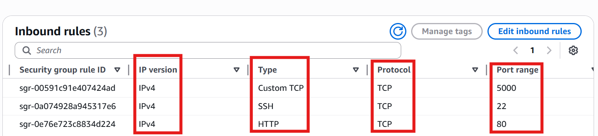

#### Step 4: Launch EC2 Instances

Create two instances for staging and production:

| Instance | Purpose | Note |
|----------|---------|------|
| Staging | Pre-production testing | Note Public DNS for `HOSTNAME_DEPLOY_STAGING` |
| Production | Live environment | Note Public DNS for `HOSTNAME_DEPLOY_PROD` |

> 💡 **Tip:** Attach the key pair and security group to both instances.

---

### 🔍 SonarCloud Setup

#### Step 1: Create Account

Create a SonarCloud account at [sonarcloud.io](https://sonarcloud.io/).

#### Step 2: Generate Token

1. Go to **My Account** → **Security**
2. Generate a new token
3. Save it for GitLab configuration

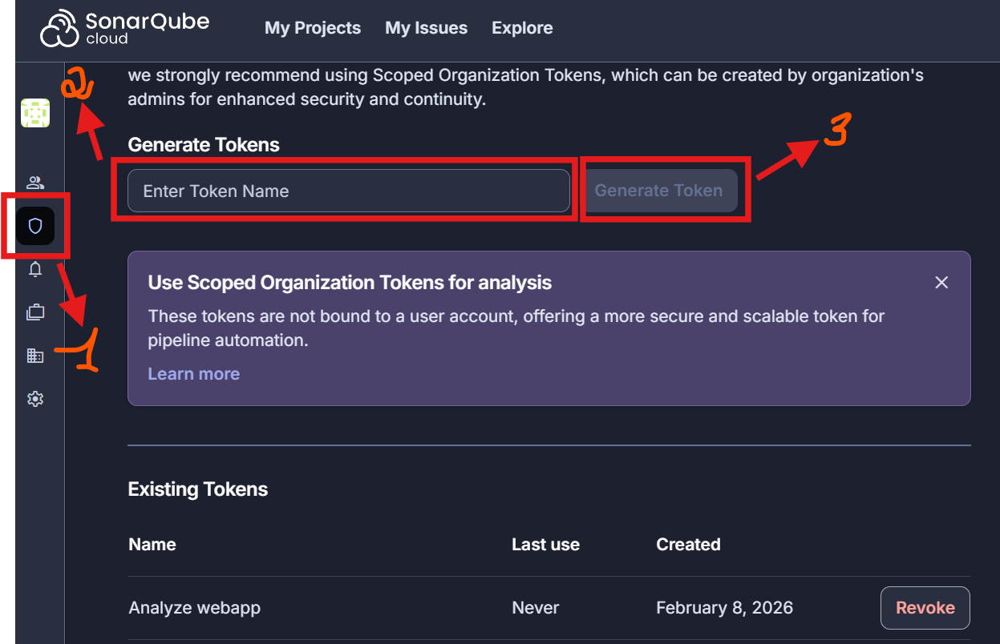

#### Step 3: Note Project Details

Retrieve the following values:

| Variable | Location |
|----------|----------|
| `SONAR_ORGANIZATION` | Organization settings |
| `SONAR_PROJECT_KEY` | Project settings |
| `SONAR_HOST_URL` | `https://sonarcloud.io` |

---

### 🦊 GitLab Configuration

#### Step 1: Create Project

1. Create a GitLab account
2. Create a new project
3. Import all project files

#### Step 2: Configure CI/CD Variables

Navigate to **Settings** → **CI/CD** → **Variables** → **Project variables**

Add the following variables:

| Variable | Type | Description |
|----------|------|-------------|
| `AWS_ACCESS_KEY_ID` | Variable | AWS access key |
| `AWS_SECRET_ACCESS_KEY` | Variable (Masked) | AWS secret key |
| `AWS_DEFAULT_REGION` | Variable | AWS region (e.g., `us-east-1`) |
| `HOSTNAME_DEPLOY_STAGING` | Variable | Staging server DNS |
| `HOSTNAME_DEPLOY_PROD` | Variable | Production server DNS |
| `SONAR_ORGANIZATION` | Variable | SonarCloud organization |
| `SONAR_PROJECT_KEY` | Variable | SonarCloud project key |
| `SONAR_HOST_URL` | Variable | `https://sonarcloud.io` |
| `SSH_USER` | Variable | SSH username (e.g., `ubuntu`) |
| `SSH_KEY` | File (Masked) | Private SSH key content |

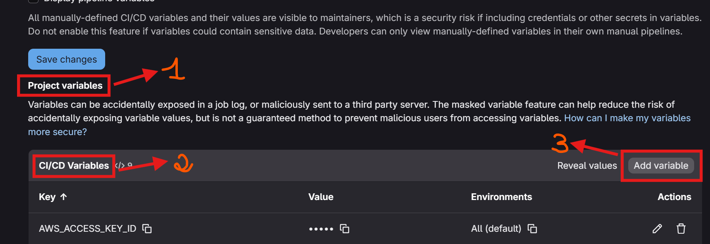

---

## 🔄 Pipeline Stages

### Stage 1: Lint

Validates code syntax using **Flake8** (Python) and **Hadolint** (Dockerfile).
```yaml
lint:
  stage: lint
  script:
    - pip install flake8
    - flake8 app/
    - docker run --rm -i hadolint/hadolint < Dockerfile
```

> 🔄 **Trigger:** Always executed on any branch push.

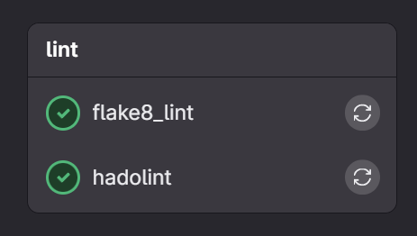

✅ **Success Criteria:** No syntax errors or style violations.

---

### Stage 2: Build

Builds the Docker image as an artifact for subsequent stages.
```yaml
build:
  stage: build
  script:
    - docker build -t $CI_REGISTRY_IMAGE:$CI_COMMIT_SHA .
```

> 🔄 **Trigger:** Always executed on any branch push.

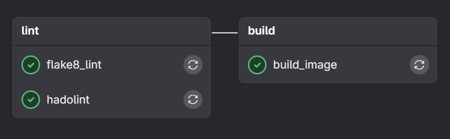

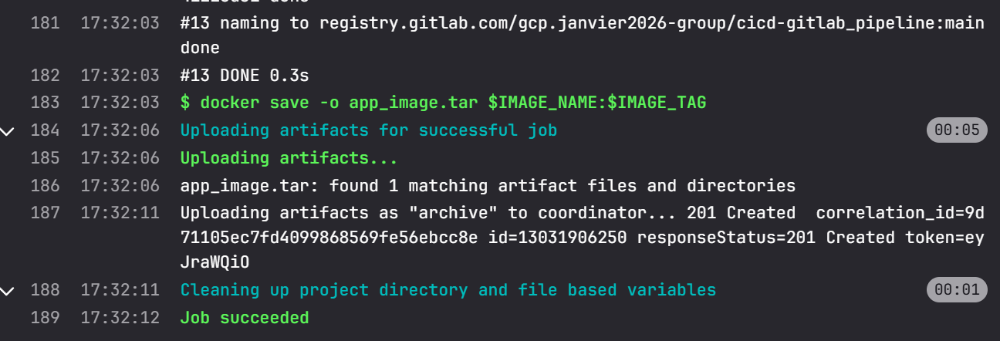

✅ **Success Criteria:** Docker image built successfully.

---

### Stage 3: Security Scan

Analyzes the Docker image for security vulnerabilities using **Trivy**.
```yaml
security_scan:
  stage: security
  script:
    - trivy image --severity HIGH,CRITICAL $CI_REGISTRY_IMAGE:$CI_COMMIT_SHA
```

> 🔄 **Trigger:** Always executed on any branch push.

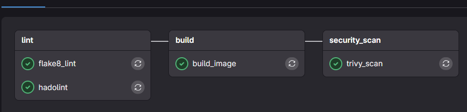

✅ **Success Criteria:** No critical vulnerabilities detected.

---

### Stage 4: Tests

Executes unit and integration tests simultaneously.
```yaml
unit_tests:
  stage: test
  script:
    - pytest tests/unit/

integration_tests:
  stage: test
  script:
    - pytest tests/integration/
```

> 🔄 **Trigger:** Always executed on any branch push.

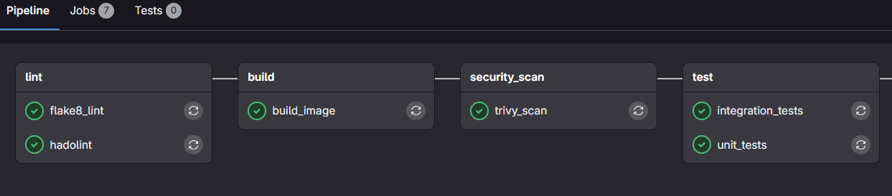

| Test Type | Result |
|-----------|--------|
| Integration Tests | 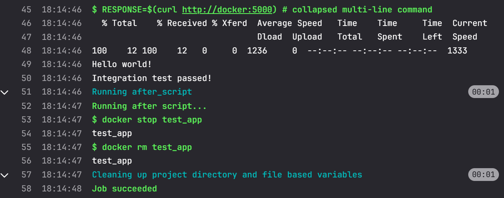 |
| Unit Tests | 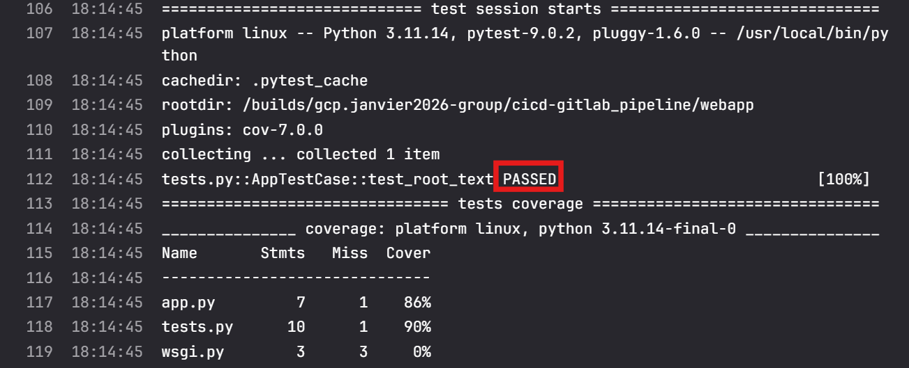 |

✅ **Success Criteria:** All tests pass.

---

### Stage 5: Code Quality

Performs static code analysis with SonarCloud to ensure quality standards.
```yaml
sonarqube:
  stage: quality
  script:
    - sonar-scanner
      -Dsonar.projectKey=$SONAR_PROJECT_KEY
      -Dsonar.organization=$SONAR_ORGANIZATION
      -Dsonar.host.url=$SONAR_HOST_URL
```

> 🔄 **Trigger:** Always executed on any branch push.

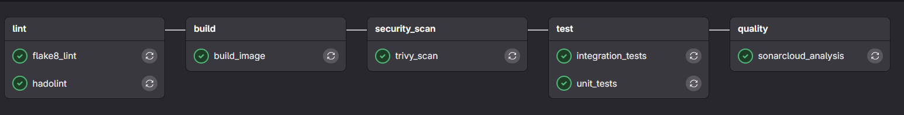

#### 📊 Quality Results

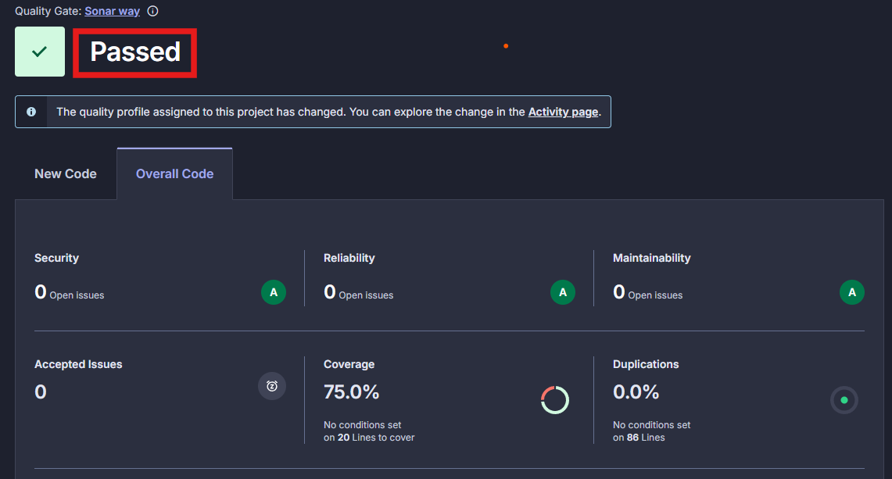

✅ **Success Criteria:** Quality gate passed.

---

### Stage 6: Packaging

Creates a release and pushes it to the GitLab Container Registry.
```yaml
package:
  stage: package
  script:
    - docker push $CI_REGISTRY_IMAGE:$CI_COMMIT_TAG
  rules:
    - if: $CI_COMMIT_BRANCH == "main"
    - if: $CI_MERGE_REQUEST_ID
```

> 🔄 **Trigger:** Main branch and merge requests only.

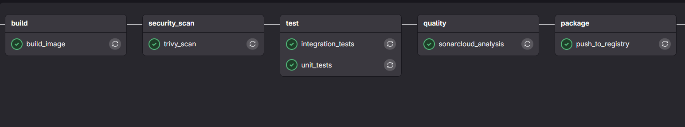

#### 📦 Container Registry

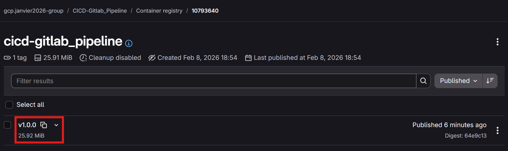

✅ **Success Criteria:** Image pushed to registry.

---

### Stage 7: Review Deployment

Deploys the application to a temporary review environment for testing during merge requests.
```yaml
review:
  stage: review
  script:
    - deploy_to_review_environment
  environment:
    name: review/$CI_COMMIT_REF_NAME
    on_stop: stop_review
  rules:
    - if: $CI_MERGE_REQUEST_ID
```

> 🔄 **Trigger:** Merge requests only.

#### 📝 Review Workflow

1. **Create Feature Branch**
```bash
   git checkout -b feature/new-feature
   git push origin feature/new-feature
```

   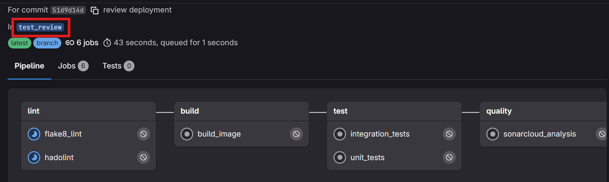

2. **Create Merge Request**

   The review deployment is triggered automatically.

   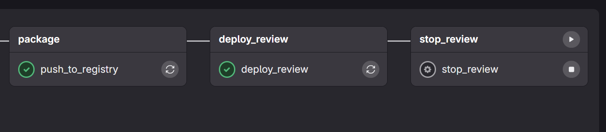

3. **Review Instance Created**

   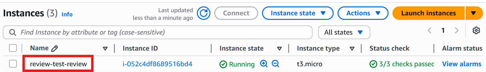

   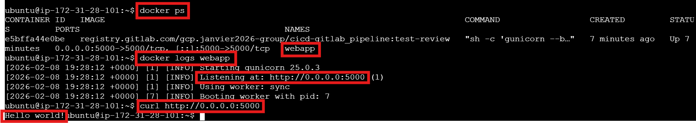

4. **Manual Cleanup**

   After testing, delete the review environment manually.

   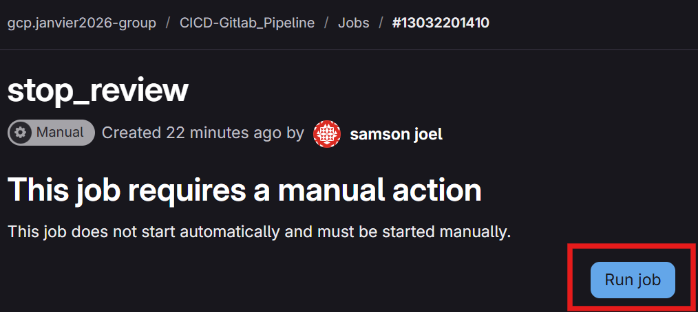

   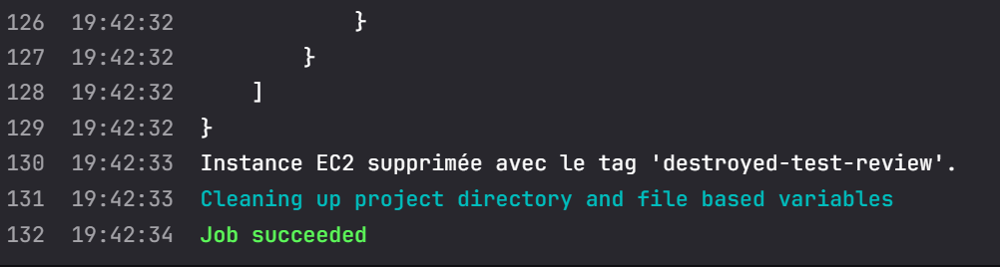

   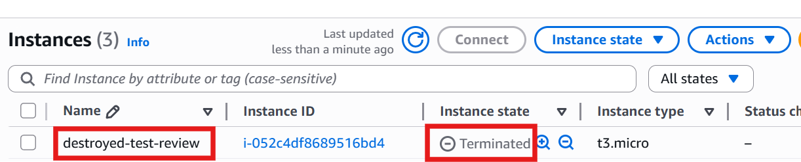

✅ **Success Criteria:** Review environment functional, then cleaned up.

---

### Stage 8: Staging & Production

Deploys the application to staging and production environments.
```yaml
deploy_staging:
  stage: deploy
  script:
    - deploy_to_staging
  environment:
    name: staging
  rules:
    - if: $CI_COMMIT_BRANCH == "main"

deploy_production:
  stage: deploy
  script:
    - deploy_to_production
  environment:
    name: production
  rules:
    - if: $CI_COMMIT_BRANCH == "main"
  when: manual
```

> 🔄 **Trigger:** Main branch only.

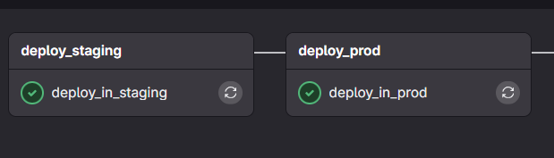

✅ **Success Criteria:** Applications deployed and accessible.

---

### Stage 9: Validation Tests

Ensures the application works correctly in staging and production environments.
```yaml
validate_staging:
  stage: validate
  script:
    - curl -f http://$HOSTNAME_DEPLOY_STAGING:5000/health
  rules:
    - if: $CI_COMMIT_BRANCH == "main"

validate_production:
  stage: validate
  script:
    - curl -f http://$HOSTNAME_DEPLOY_PROD:5000/health
  rules:
    - if: $CI_COMMIT_BRANCH == "main"
```

> 🔄 **Trigger:** Main branch only.

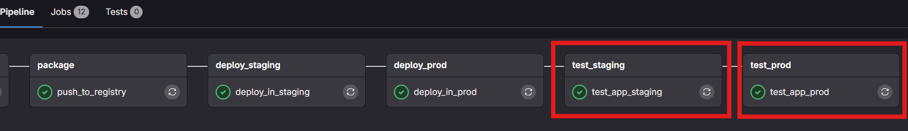

| Environment | Validation |
|-------------|------------|
| Staging | 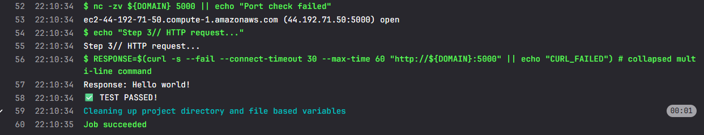 |
| Production | 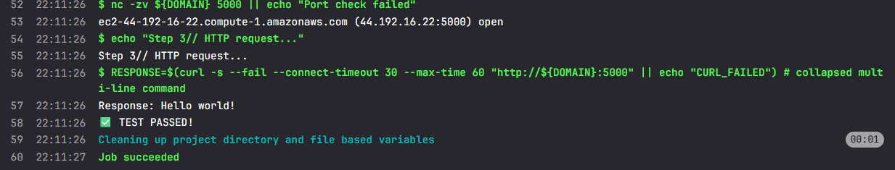 |

✅ **Success Criteria:** Health checks pass in both environments.

---

## 🛠️ Troubleshooting

| Issue | Possible Cause | Solution |
|-------|----------------|----------|
| Lint fails | Code style violations | Run `flake8` locally and fix issues |
| Build fails | Dockerfile errors | Validate Dockerfile with `hadolint` |
| Security scan fails | Critical vulnerabilities | Update base image or dependencies |
| Tests fail | Code bugs | Review test logs and fix failing tests |
| Deployment fails | SSH connection issues | Verify SSH key and security group |
| SonarQube fails | Invalid token | Regenerate SonarCloud token |

### 🔍 Useful Commands
```bash
# Run linting locally
flake8 app/
hadolint Dockerfile

# Run tests locally
pytest tests/

# Check Docker build
docker build -t myapp .

# Test SSH connection
ssh -i key.pem ubuntu@hostname

# Check SonarCloud status
curl -u token: https://sonarcloud.io/api/system/status
```

---

## 📁 Project Structure
```
gitlab-cicd-project/
├── .gitlab-ci.yml          # Pipeline configuration
├── Dockerfile              # Container definition
├── requirements.txt        # Python dependencies
├── app/
│   ├── __init__.py
│   ├── main.py
│   └── routes.py
├── tests/
│   ├── unit/
│   │   └── test_unit.py
│   └── integration/
│       └── test_integration.py
├── images/                 # Documentation images
└── README.md
```

---

## 📊 Pipeline Summary

| Stage | Branch | Merge Request | Main |
|-------|:------:|:-------------:|:----:|
| Lint | ✅ | ✅ | ✅ |
| Build | ✅ | ✅ | ✅ |
| Security Scan | ✅ | ✅ | ✅ |
| Tests | ✅ | ✅ | ✅ |
| Code Quality | ✅ | ✅ | ✅ |
| Packaging | ❌ | ✅ | ✅ |
| Review Deploy | ❌ | ✅ | ❌ |
| Staging Deploy | ❌ | ❌ | ✅ |
| Production Deploy | ❌ | ❌ | ✅ |
| Validation Tests | ❌ | ❌ | ✅ |

---

## 📚 Resources

- [GitLab CI/CD Documentation](https://docs.gitlab.com/ee/ci/)
- [SonarCloud Documentation](https://docs.sonarcloud.io/)
- [Trivy Documentation](https://aquasecurity.github.io/trivy/)
- [Flask Documentation](https://flask.palletsprojects.com/)

---

## 👨‍💻 Author

**Kevin Lagaza**

---

## 📄 License

This project is licensed under the MIT License.